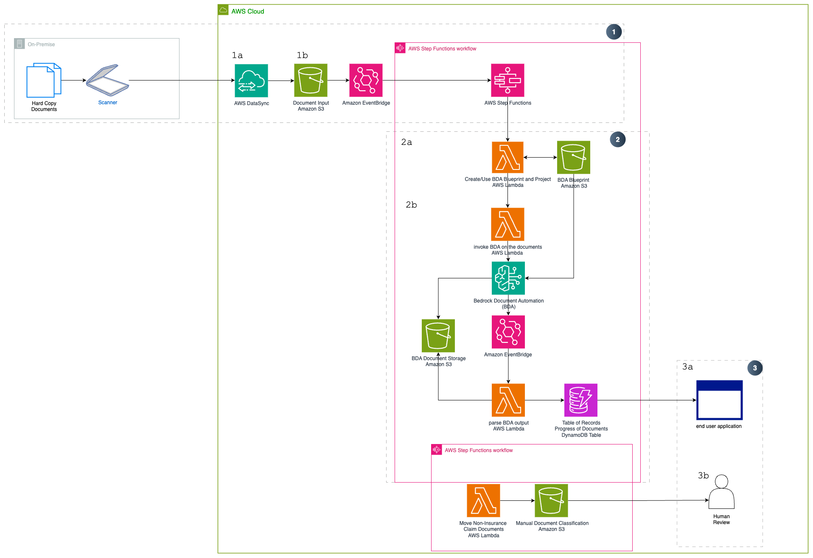
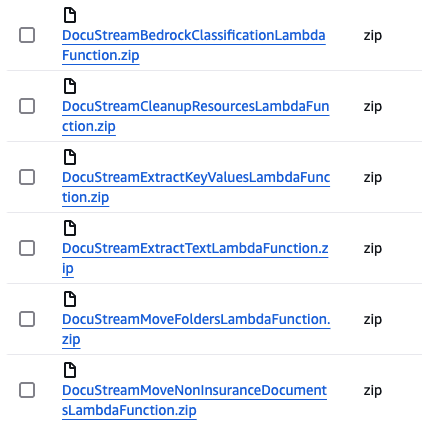
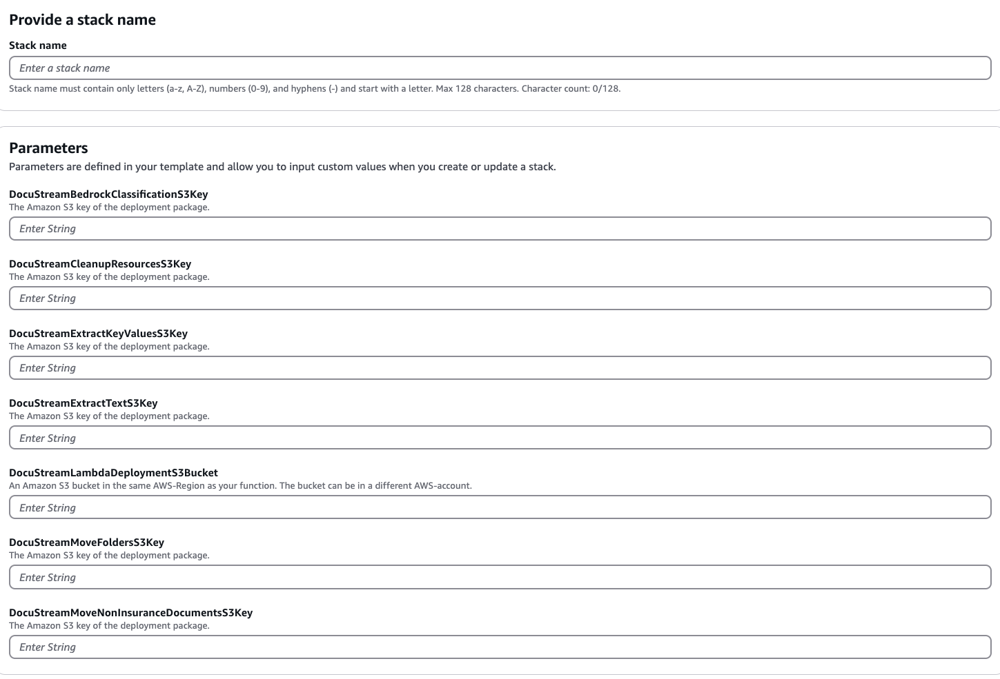
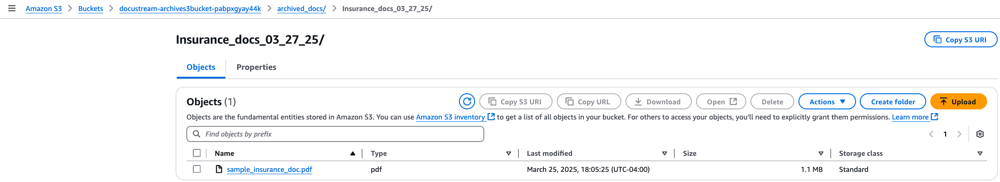

# DocStream
## Cost-effectively Automate FNOL Document Classification for Insurance Claims

## Overview

The proposed solution aims to automate the indexing and processing of manually scanned bills and documents received via hardcopy, transitioning from a traditional manual process to a streamlined, efficient workflow. The key components of the solution include identifying file types in the staging area, routing files based on the document type to their respective bucket initiating a downstream process. This automated approach enhances document handling, reduces manual intervention, ensures accurate document identification and processing, and ultimately boosts operational efficiency, improves customer satisfaction, and lowers costs, creating a faster and more reliable document processing system.
  > **Note:** This solution can be used to classify multiple types of insurance claim documents (life, auto, etc.). However, in this example we configured the workflow to process **`Auto Insurance Claim Documents`** using **Amazon Bedrock Data Automation (BDA)**. Users can customize the document classification by modifying the BDA blueprint configuration in the initialization Lambda function.  

## Core Features

 * Intelligent Document Processing using Amazon Bedrock Data Automation (BDA)
 * Automated project initialization and credential management via AWS Secrets Manager
 * Intelligent execution monitoring with prevention of overlapping runs
 * Fully Scalable to meet any customer demand
 * Easy modifiable to change categorization through BDA blueprint configuration
 * Comprehensive error handling with automatic routing to review bucket

## Target Market 

This solution is designed for industries that rely heavily on manual document processing, which can be streamlined and automated. The target market for this offering includes businesses across various Insurance and banking sectors that struggle with inefficient paperwork management and classification. 

By digitizing hardcopy documents and automating the associated workflows, this solution can deliver significant time and cost savings for the customer. The manual processes often result in delays and bottlenecks, as employees spend valuable resources on non-value-added tasks like classifying and sorting documentation. This not only adds resilience to the documentation processes, but also reduces the need for manual intervention in these time-consuming activities.

The key value proposition for the target market is the ability to transform manual, paper-based operations into efficient, digitized workflows. This can result in improved productivity, reduced administrative overhead, and better control over critical business documentation. The automation of document-centric processes allows the customer to reallocate resources towards more strategic initiatives, rather than getting bogged down in the classification and management of hardcopy documents. 


## Technical Architecture
[](https://github.com/aws-samples/sample-FSI-document-processing-with-amazon-bedrock/blob/main/IDP%20with%20Gen%20AI%20(Bedrock%20Data%20Automation)/assets/BDA.drawio.png)

This solution leverages **Amazon Bedrock Data Automation (BDA)** to process and classify insurance documents. The workflow automatically initiates BDA projects, manages credentials via AWS Secrets Manager, and monitors execution status to prevent overlapping runs.

The application consists of 4 major components:

### 1. Document Ingestion & Initialization
1a. Physical (hardcopy) documents are scanned and securely uploaded to the `input` S3 bucket (under `data_automation/input/` folder structure).

1b. Upon upload, an **Amazon EventBridge** event is emitted, triggering an automated workflow orchestrated by **AWS Step Functions**.
  > **Note:** This automation must be enabled using an **EventBridge Scheduler**.

1c. The Step Functions workflow first checks for existing files in the bucket. If no files are found, the execution completes successfully without further processing.

1d. If files are present, the workflow proceeds to initialize the BDA project:
   - **BDA Init Lambda** creates or finds an existing BDA blueprint
   - Creates or finds the project configuration
   - Stores credentials securely in **AWS Secrets Manager**

### 2. Document Processing with Bedrock Data Automation
2a. The **Execute BDA Lambda** retrieves project information and initiates the Bedrock Data Automation run.

2b. The **Status Check** step monitors the BDA execution:
   - Verifies if the run completed successfully
   - If still in progress, the workflow waits to prevent overlapping runs
   - Handles both `service.error` and `client.error` exceptions

  > **Note:** This workflow is designed to process **PDF documents only.** Non-PDF files will be filtered and moved to a `human review` S3 bucket.

### 3. Data Extraction & Classification
3a. After successful BDA execution, the **Extract Values Lambda** processes the output:
   - Retrieves classification results from the BDA output stored in the `data_automation/output/` folder
   - Extracts key-value pairs from the processed documents
   - Results are stored as `result.json` in subfolders

3b. Based on the classification result, the **AWS Step Functions Choice state** determines the appropriate downstream S3 destination. Different **AWS Lambda functions** are triggered accordingly.

### If the document is classified as a valid auto claim:
a. Key-value pairs are extracted from the BDA output and stored in a dedicated **Amazon DynamoDB** table.

b. The original `.pdf` is archived in the **Archive S3 bucket** for long-term storage.

c. Extracted data includes all relevant insurance claim information defined in the BDA blueprint.

### If the document is *not* classified as a valid auto claim:
a. It is moved to the **Review S3 bucket** for further human review.

b. If errors occur during extraction (`Extract Values Lambda` failures), documents are also routed to the review bucket.

c. At the conclusion of the Step Functions workflow, any temporary resources used during processing are **automatically cleaned up**.


### 4. Downstream Applications
4a. The classified auto claim documents and their associated **DynamoDB records** can be integrated into downstream systems such as:
  - **Monitoring dashboards**
  - **Analytics platforms**
  - **Automated workflows**
  
4b. Documents not classified as valid auto claims are **reviewed manually** and processed accordingly.


## Implementation Guide


### Important Notes
* This solution uses AWS CloudFormation templates and stacks to automate its deployment. The CloudFormation template specifies the AWS resources included in this solution and their properties. The CloudFormation stack provisions the resources that are described in the template.

### Pre-requisites

1. Ensure you have downloaded the:
  Cloud Formation Template: [DocuStream.yaml](https://github.com/aws-samples/sample-FSI-document-processing-with-amazon-bedrock/blob/main/IDP%20with%20Gen%20AI%20(Bedrock%20Data%20Automation)/infrastructure/cloudformation/DocuStream.yaml)
  [Lambda Deployment Packages](https://github.com/aws-samples/sample-FSI-document-processing-with-amazon-bedrock/tree/main/IDP%20with%20Gen%20AI%20(Bedrock%20Data%20Automation)/lambdas) (6 packages in total)

2. Deploying the Lambda Packages
 2a. Create an Amazon S3 bucket (with a unique name)
 2b. Upload the 6 .zip files into the S3 Bucket (created in step 2a)
    should looks something similar to:

    [](https://github.com/aws-samples/sample-FSI-document-processing-with-amazon-bedrock/blob/main/IDP%20with%20Gen%20AI%20(Bedrock%20Data%20Automation)/assets/lambda-bucket.png)  

3. Bedrock Model Access
 * **Ensure you have** [access to the Amazon Nova Model on Amazon Bedrock in US-EAST-1](https://docs.aws.amazon.com/bedrock/latest/userguide/getting-started.html)
 Note: this solution needs the **Amazon Nova Lite Model**, which is available in **US-EAST-1**
[](https://github.com/aws-samples/sample-FSI-document-processing-with-amazon-bedrock/blob/main/IDP%20with%20Gen%20AI%20(Bedrock%20Data%20Automation)/assets/bedrock_access.png)

 
 #### Launch the Stack

1. Sign in to the AWS Management Console and search for CloudFormation in the US-East-1 (N.Virginia) Region
2. Click Create Stack
3. Choose an existing template
4. Under **Template Source** choose Upload a Template File and choose the [DocuStream.yaml](https://github.com/aws-samples/sample-FSI-document-processing-with-amazon-bedrock/blob/main/IDP%20with%20Gen%20AI%20(Bedrock%20Data%20Automation)/infrastructure/cloudformation/DocuStream.yaml) AWS CloudFormation template from the prerequisites
5. On the Specify stack details page, assign a name to your solution stack
6. Under Parameters, review the parameters for this solution template
[](https://github.com/aws-samples/sample-FSI-document-processing-with-amazon-bedrock/blob/main/IDP%20with%20Gen%20AI%20(Bedrock%20Data%20Automation)/assets/Parameter_input.png)

6a. The CloudFormation template includes the following parameters (many are pre-configured):

    **BlueprintName** -> Pre-set by CloudFormation (default value provided)

    **DynamoDBTableName** -> Pre-set by CloudFormation (default value provided)

    **ProjectName** -> Pre-set by CloudFormation (default value provided)

    **ArchiveS3BucketName** -> Optional: Provide a custom name for the archive S3 bucket

    **InputS3BucketName** -> Optional: Provide a custom name for the input S3 bucket

    **OutputS3BucketName** -> Optional: Provide a custom name for the output S3 bucket

    **ReviewS3BucketName** -> Optional: Provide a custom name for the review S3 bucket

7. Select Next.
8. On the Configure stack options page, select the box acknowledging that the template will create IAM resources, then choose Next.
9. On the Review and create page, review and confirm the settings.
10. Choose Submit to deploy the stack.
11. You can view the status of the stack in the AWS CloudFormation console in the Status column. You should receive a CREATE_COMPLETE status in approximately five minutes.

 #### Post-Deployment Configuration

**Important:** After the CloudFormation stack is created, you must create the required folder structure in the input S3 bucket:

1. Navigate to the input S3 bucket created by the CloudFormation stack
2. Create the following folder structure:
   ```
   data_automation/
   ├── input/
   └── output/
   ```
3. To create these folders:
   - Create a folder named `data_automation`
   - Inside `data_automation`, create a folder named `input`
   - Inside `data_automation`, create a folder named `output`

This folder structure is required for the Bedrock Data Automation (BDA) workflow to function properly.

 #### Test the Solution

1. Navigate to the Input S3 bucket created by CloudFormation
2. Upload sample PDF documents for testing to the `data_automation/input/` folder
   - Ensure the documents are valid PDF files
   - Test with both valid insurance claim documents and non-insurance documents

3. Trigger the Step Functions workflow:
   - Go to AWS Step Functions in the console
   - Find the Step Function created by the CloudFormation template
   - The workflow will automatically process files when triggered by EventBridge, or you can manually execute it

4. Monitor the execution:
   - Watch the Step Functions execution progress
   - The workflow includes the following key steps:
     - File listing and validation
     - BDA initialization
     - BDA execution
     - Status checking (with wait states for in-progress runs)
     - Value extraction
     - Document routing

5. Check the outputs:
   - **Successfully classified insurance documents**: Check the **Archive S3 bucket** for archived PDFs
   [](https://github.com/aws-samples/sample-FSI-document-processing-with-amazon-bedrock/blob/main/IDP%20with%20Gen%20AI%20(Bedrock%20Data%20Automation)/assets/correct_classified.png)
   - **Non-insurance or error documents**: Check the **Review S3 bucket** for documents requiring manual review
   - **Extracted data**: Query the **DynamoDB table** to see the extracted key-value pairs from successfully processed documents
   - **BDA outputs**: Check the `data_automation/output/` folder for `result.json` files containing detailed processing results

