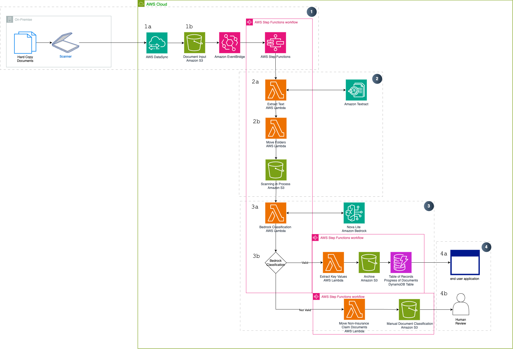
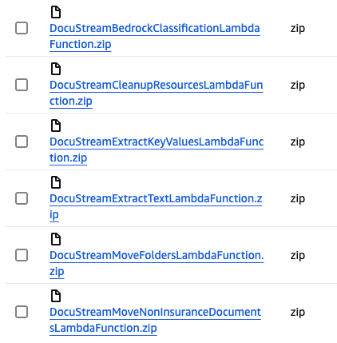
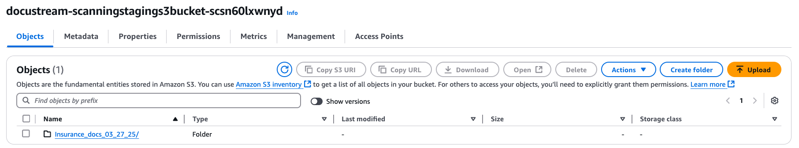

# DocStream
## Cost-effectively Automate FNOL Document Classification for Insurance Claims

## Overview

The proposed solution aims to automate the indexing and processing of manually scanned bills and documents received via hardcopy, transitioning from a traditional manual process to a streamlined, efficient workflow. The key components of the solution include identifying file types in the staging area, routing files based on the document type to their respective bucket initiating a downstream process. This automated approach enhances document handling, reduces manual intervention, ensures accurate document identification and processing, and ultimately boosts operational efficiency, improves customer satisfaction, and lowers costs, creating a faster and more reliable document processing system.

## Core Features

 * Intelligent Document Processing reducing manual categorization 
 * Fully Scalable to meet any customer demand
 * Easy modifiable to change categorization

## Target Market

This solution is designed for industries that rely heavily on manual document processing, which can be streamlined and automated. The target market for this offering includes businesses across various Insurance and banking sectors that struggle with inefficient paperwork management and classification. 

By digitizing hardcopy documents and automating the associated workflows, this solution can deliver significant time and cost savings for the customer. The manual processes often result in delays and bottlenecks, as employees spend valuable resources on non-value-added tasks like classifying and sorting documentation. This not only adds resilience to the documentation processes, but also reduces the need for manual intervention in these time-consuming activities.

The key value proposition for the target market is the ability to transform manual, paper-based operations into efficient, digitized workflows. This can result in improved productivity, reduced administrative overhead, and better control over critical business documentation. The automation of document-centric processes allows the customer to reallocate resources towards more strategic initiatives, rather than getting bogged down in the classification and management of hardcopy documents.

## Technical Architecture

The application is 4 major components:

1. Document Hardcopy to Soft copy storage  
    a. Hardcopy documents are scanned and securely uploaded to an S3 bucket using AWS DataSync over an encrypted TLS channel.  

    b. When a document is uploaded, an Amazon EventBridge event triggers the next component, which is orchestrated by AWS Step Functions.

2. Document Analysis  
    a. The document text key words and phrases are extracted by Amazon Textract  

    b. After the extraction is completed the document is moved to the Analyzed Documents S3 bucket
3. Document Classification  
    a. The extracted text from the scanned documents is passed as context input to a Bedrock call, where a Amazon Nova Model classifies the document content.

    b. The classification output determines which downstream S3 bucket the document should be moved to. Where a lambda function takes the classification output and moves the documents to the appropriate S3 bucket.

    c. When a document is automatically classified, the key values of the document is stored in a AWS DynamoDB table of records.

    d. If a document cannot be automatically classified, it is sent to a manual classification bucket for further human review.
4. Downstream applications  
    a. The automatically classified documents and DynamoDB Table of records can be leveraged in applications such as monitoring applications or dashboards 

    b. The manually classified documents are reviewed by a human and then processed further.

## Implementation Guide

### Important Notes
* This solution uses AWS CloudFormation templates and stacks to automate its deployment. The CloudFormation template specifies the AWS resources included in this solution and their properties. The CloudFormation stack provisions the resources that are described in the template.

### Pre-requisites
 
 * Ensure you have downloaded the:
  Cloud Formation Template [DocuStream.yaml](https://gitlab.aws.dev/docstream-team-group/DocStream/-/blob/main/infrastructure/cloudformation/DocuStream.yaml)  
  [Lambda Deployment Packages](https://gitlab.aws.dev/docstream-team-group/DocStream/-/tree/main/lambdas) (5 packages in total)

 * Using the Lambda Packages
 1. Create an Amazon S3 bucket (with a unique name)
 2. Upload the 6 .zip files into the S3 Bucket (created in step 1)
    should looks something similar to:

      

 * **Ensure you have** [access to the Amazon Nova Model on Amazon Bedrock in US-EAST-1](https://docs.aws.amazon.com/bedrock/latest/userguide/getting-started.html)  
 Note: this solution needs the **Amazon Nova Lite Model**, which are availabile in **US-EAST-1**

 
 #### Launch the Stack

1. Sign in to the AWS Management Console and search for CloudFormation in the US-East-1 (N.Virginia) Region 
2. Click Create Stack
3. Choose an existing template
4. Under **Template Source** choose Upload a Template File and choose the [DocuStream.yaml](https://gitlab.aws.dev/docstream-team-group/DocStream/-/blob/main/infrastructure/cloudformation/DocuStream.yaml) AWS CloudFormation template from the prerequisites
5. On the Specify stack details page, assign a name to your solution stack
6. Under Parameters, review the parameters for this solution template   
use the lambda deployment package names (including.zip) from S3 to fill in the Parameters  (note the order of these parameters may not be the same)

    DocuStreamCleanupResourcesS3Key -> **DocuStreamCleanupResourcesLambdaFunction.zip**  

    DocuStreamBedrockClassificationS3Key ->  **DocuStreamBedrockClassificationLambdaFunction.zip**

    DocuStreamExtractKeyValuesS3Key -> **DocuStreamExtractKeyValuesLambdaFunction.zip** 

    DocuStreamLambdaDeploymentS3Bucket ->  **name of your S3 bucket i.e Docu-stream-bucket**

    DocuStreamMoveFoldersS3Key -> **DocuStreamMoveFoldersLambdaFunction.zip**
    
    DocuStreamMoveNonInsuranceDocumentsS3Key ->
    **DocuStreamMoveNonInsuranceDocumentsLambdaFunction.zip**  

    DocuStreamExtractTextS3Key -> **DocuStreamExtractTextLambdaFunction.zip**  

7. Select Next.
8. On the Configure stack options page, select the box acknowledging that the template will create IAM resources. choose Next.
9. On the Review and create page, review and confirm the settings.
10. Choose Submit to deploy the stack.
11. You can view the status of the stack in the AWS CloudFormation console in the Status column. You should receive a CREATE_COMPLETE status in approximately five minutes.

 #### Test the Solution
 1. In the S3 bucket [stack_name]-scanningstagings3bucket-xxxxxx create a new folder

 2. Upload sample documents for testing in the folder created
 3. Go to AWS Step Functions and find the Step Function that was created by the CloudFormation template
 4. run the Step function
 5. check the outputs of the step function  
 5a. The correctly classifed insurance documents will be in the [stack_name]-archivess3bucket-xxxxxx  
 
 5b. the other documents will be in [stack_name]-noninsurancedocumentss3bucket-xxxxxx or [stack_name]-humanreviews3bucket-xxxxxx

