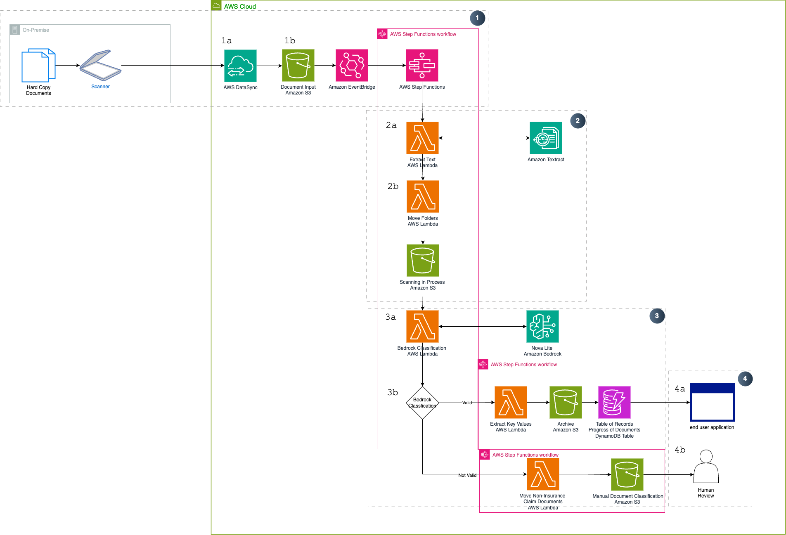
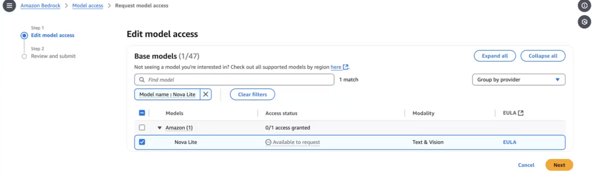
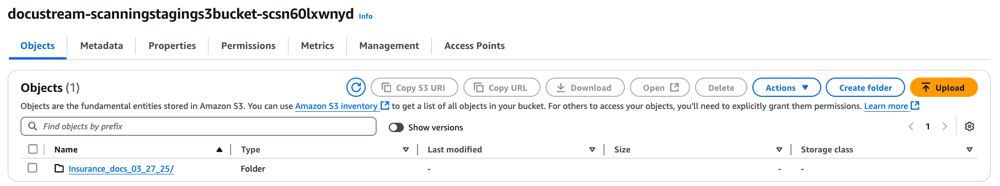

# DocStream
## Cost-effectively Automate FNOL Document Classification for Insurance Claims

## Overview

The proposed solution aims to automate the indexing and processing of manually scanned bills and documents received via hardcopy, transitioning from a traditional manual process to a streamlined, efficient workflow. The key components of the solution include identifying file types in the staging area, routing files based on the document type to their respective bucket initiating a downstream process. This automated approach enhances document handling, reduces manual intervention, ensures accurate document identification and processing, and ultimately boosts operational efficiency, improves customer satisfaction, and lowers costs, creating a faster and more reliable document processing system.
  > **Note:** This solution can be used to classify multiple types of insurance claim documents (life, auto, etc.). However, in this example we configured the workflow to process **`Auto Insurance Claim Documents`**. Users can customize the insurance type by modifying the system prompt in the `Bedrock Classification Lambda Function`.

## Core Features

 * Intelligent Document Processing reducing manual categorization 
 * Fully Scalable to meet any customer demand
 * Easy modifiable to change categorization

## Target Market

This solution is designed for industries that rely heavily on manual document processing, which can be streamlined and automated. The target market for this offering includes businesses across various Insurance and banking sectors that struggle with inefficient paperwork management and classification. 

By digitizing hardcopy documents and automating the associated workflows, this solution can deliver significant time and cost savings for the customer. The manual processes often result in delays and bottlenecks, as employees spend valuable resources on non-value-added tasks like classifying and sorting documentation. This not only adds resilience to the documentation processes, but also reduces the need for manual intervention in these time-consuming activities.

The key value proposition for the target market is the ability to transform manual, paper-based operations into efficient, digitized workflows. This can result in improved productivity, reduced administrative overhead, and better control over critical business documentation. The automation of document-centric processes allows the customer to reallocate resources towards more strategic initiatives, rather than getting bogged down in the classification and management of hardcopy documents.

## Technical Architecture

The application is 4 major components:

### 1. Hardcopy to Softcopy Storage
a. Physical (hardcopy) documents are scanned and securely uploaded to the `scanning staging` S3 bucket using **AWS DataSync** over an encrypted TLS connection.  

b. Upon upload, an **Amazon EventBridge** event is emitted, triggering an automated workflow orchestrated by **AWS Step Functions**.  
  > **Note:** This automation must be enabled using an **EventBridge Scheduler**.
  
### 2. Document Analysis
a. The uploaded documents are analyzed using **Amazon Textract**, which extracts textual content and stores it as both `.txt` and `.json` files in the `scanning text` S3 bucket.  

b. The original `.pdf` file is then moved from the `scanning staging` S3 bucket to the `scanning in process` S3 bucket to indicate its progression in the workflow.

  > **Note:** This workflow is designed to process **PDF documents only.** The `Extract Text Lamdba Function` will filter out non-PDF files and move them to a `human review` S3 bucket. However, if no PDF files are present, the State Machine execution will end in a "failed" state.

### 3. Document Classification
a. The `.txt` version of each document, stored in the `scanning text` S3 bucket, is provided as context input to **Amazon Bedrock**, where **Nova Lite** classifies the content.

b. Based on the classification result, the **AWS Step Functions Choice state** determines the appropriate downstream S3 destination. Different **AWS Lambda functions** are triggered accordingly.

### If the document is classified as a valid auto claim:
a. User-defined key-value pairs are extracted from the `.json` version of the document (defined in the `Extract Key Values Lambda function`).

b. Extracted data is stored in a dedicated **Amazon DynamoDB** table.

c. The original `.pdf` is archived in a long-term storage S3 bucket.

### If the document is *not* classified as a valid auto claim:
a. It is moved to a `non insurance documents` S3 bucket for further human review.

b. At the conclusion of the Step Functions workflow, any temporary resources used during processing are **automatically deleted**.

### 4. Downstream Applications
a. The classified auto claim documents and their associated **DynamoDB records** can be integrated into downstream systems such as:
  - **Monitoring dashboards**
  - **Analytics platforms**
  - **Automated workflows**
  
b. Documents not classified as valid auto claims are **reviewed manually** and processed accordingly.

## Implementation Guide

### Important Notes
* This solution uses AWS CloudFormation templates and stacks to automate its deployment. The CloudFormation template specifies the AWS resources included in this solution and their properties. The CloudFormation stack provisions the resources that are described in the template.

### Pre-requisites
 
 * Ensure you have downloaded the:
  Cloud Formation Template [DocuStream.yaml](https://gitlab.aws.dev/docstream-team-group/DocStream/-/blob/main/infrastructure/cloudformation/DocuStream.yaml)  
  [Lambda Deployment Packages](https://gitlab.aws.dev/docstream-team-group/DocStream/-/tree/main/lambdas) (5 packages in total)

 * Using the Lambda Packages
 1. Create an Amazon S3 bucket (with a unique name)
 2. Upload the 6 .zip files into the S3 Bucket (created in step 1)
    should looks something similar to:

      

 * **Ensure you have** [access to the Amazon Nova Model on Amazon Bedrock in US-EAST-1](https://docs.aws.amazon.com/bedrock/latest/userguide/getting-started.html)  
 Note: this solution needs the **Amazon Nova Lite Model**, which are availabile in **US-EAST-1**

 
 #### Launch the Stack

1. Sign in to the AWS Management Console and search for CloudFormation in the US-East-1 (N.Virginia) Region 
2. Click Create Stack
3. Choose an existing template
4. Under **Template Source** choose Upload a Template File and choose the [DocuStream.yaml](https://gitlab.aws.dev/docstream-team-group/DocStream/-/blob/main/infrastructure/cloudformation/DocuStream.yaml) AWS CloudFormation template from the prerequisites
5. On the Specify stack details page, assign a name to your solution stack
6. Under Parameters, review the parameters for this solution template   
use the lambda deployment package names (including.zip) from S3 to fill in the Parameters  (note the order of these parameters may not be the same)

    DocuStreamCleanupResourcesS3Key -> **DocuStreamCleanupResourcesLambdaFunction.zip**  

    DocuStreamBedrockClassificationS3Key ->  **DocuStreamBedrockClassificationLambdaFunction.zip**

    DocuStreamExtractKeyValuesS3Key -> **DocuStreamExtractKeyValuesLambdaFunction.zip** 

    DocuStreamLambdaDeploymentS3Bucket ->  **name of your S3 bucket i.e Docu-stream-bucket**

    DocuStreamMoveFoldersS3Key -> **DocuStreamMoveFoldersLambdaFunction.zip**
    
    DocuStreamMoveNonInsuranceDocumentsS3Key ->
    **DocuStreamMoveNonInsuranceDocumentsLambdaFunction.zip**  

    DocuStreamExtractTextS3Key -> **DocuStreamExtractTextLambdaFunction.zip**  

7. Select Next.
8. On the Configure stack options page, select the box acknowledging that the template will create IAM resources. choose Next.
9. On the Review and create page, review and confirm the settings.
10. Choose Submit to deploy the stack.
11. You can view the status of the stack in the AWS CloudFormation console in the Status column. You should receive a CREATE_COMPLETE status in approximately five minutes.

 #### Test the Solution
 1. In the S3 bucket [stack_name]-scanningstagings3bucket-xxxxxx create a new folder

 2. Upload sample documents for testing in the folder created
 3. Go to AWS Step Functions and find the Step Function that was created by the CloudFormation template
 4. run the Step function
 5. check the outputs of the step function  
 5a. The correctly classifed insurance documents will be in the [stack_name]-archivess3bucket-xxxxxx  
 
 5b. the other documents will be in [stack_name]-noninsurancedocumentss3bucket-xxxxxx or [stack_name]-humanreviews3bucket-xxxxxx

